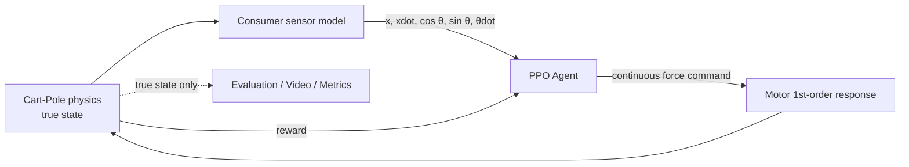

# rl-cartpole-swingup-ppo

[](https://github.com/temesotejam/rl-cartpole-swingup-ppo/actions/workflows/ci.yml)

**台車型倒立振子を、ほぼ真下から振り上げて倒立させ、その後に台車を中央へ戻しながら安定化するまでを PPO に学習させる実験リポジトリです。**

前作 [`rl-cartpole-ppo`](https://github.com/temesotejam/rl-cartpole-ppo) は「すでに直立付近にいる振り子を倒さず保つ」Balanceタスクでした。本リポジトリでは初期状態を真下まで広げ、**Swing-up → Capture → Balance → Re-center** を1つの方策で実現することを目標にします。

GitHub Actions のCPU runnerだけで学習し、学習前・25%・50%・75%・100%の動画、評価値、学習済みモデルをArtifactに保存します。GitHub Pagesを有効化すると最新の成功学習結果をブラウザから直接確認できます。

---

## 何が難しくなったのか

Balanceだけなら、振り子は最初から直立近傍です。

```text
       |
       |
   ----O----
      Cart
```

Swing-upでは、ほぼ真下から始まります。

```text
   ----O----
      Cart
       |
       |
```

台車には有限のレールしかないので、単純に一方向へ押し続けることはできません。

```text
真下
 ↓
台車を左右へ振る
 ↓
振り子へ運動エネルギーを与える
 ↓
上まで到達
 ↓
勢いを殺して倒立捕捉
 ↓
直立を維持しながら台車を中央へ戻す
```

---

## システム全体



PPOが見るのはセンサノイズを含む観測値だけです。シミュレータ内部の真値は評価にのみ使います。

---

# 物理モデル

## 状態

状態は

\[
x = [x_c,\dot{x}_c,\theta,\dot{\theta}]
\]

です。

- `x_c`: 台車位置 [m]
- `xdot`: 台車速度 [m/s]
- `theta`: 振り子角度 [rad]
- `theta = 0`: 上向き
- `theta = +/-pi`: 真下
- `theta_dot`: 振り子角速度 [rad/s]

PPOへの観測は角度の不連続を避けるため、

```text
[x, xdot, cos(theta), sin(theta), theta_dot]
```

とします。

## 標準パラメータ

| 項目 | 値 |
|---|---:|
| 台車質量 | 1.0 kg |
| 振り子質量 | 0.1 kg |
| 振り子重心長 | 0.5 m |
| 重力 | 9.81 m/s² |
| 最大駆動力 | ±10 N |
| 制御周期 | 20 ms / 50 Hz |
| レール限界 | ±2.4 m |
| 台車粘性摩擦 | 0.10 N/(m/s) |
| モータ時定数 | 50 ms |
| 1 episode | 最大20 s |

Balance版との大きな違いは、**振り子角度が大きくなってもepisodeを終了しない**ことです。Swing-upでは180°近くを通るのが正常だからです。

失敗終了は基本的に

```text
abs(cart position) > 2.4 m
```

のみです。

---

# モータモデル

PPO出力は `[-1, 1]` で、±10 Nに変換します。

ただし指令を瞬時に物理系へ与えず、50 msの一次遅れを入れています。

\[
F_{k+1}=F_k+\alpha(F_{cmd}-F_k)
\]

\[
\alpha=1-e^{-\Delta t/\tau}
\]

これにより、理想的な無遅延アクチュエータより少し現実寄りになります。

---

# センサモデル

前作と同様、PPOに真値は渡しません。

初期設定は次の通りです。

| 観測 | 毎サンプルのノイズ σ | episode固定バイアス σ |
|---|---:|---:|
| 台車位置 | 1 mm | 2 mm |
| 台車速度 | 0.01 m/s | 0.01 m/s |
| 振り子角度 | 0.25° | 1.0° |
| 角速度 | 0.10°/s | 0.30°/s |

角度・角速度は民生用MEMS IMUを意識した単純モデルです。実機の完全なdigital twinではなく、「完全な真値が取れる理想環境」から一段現実へ寄せるためのモデルです。

---

# Reward

Swing-upでは、真下から上へ向かう途中にも勾配が必要です。そのため角度二乗誤差だけではなく `cos(theta)` を中心に報酬を作っています。

概念的には、

```text
+ 上向きに近いほど高得点
+ 上向きで台車中央ならさらに加点
+ ±10°以内なら追加加点
+ ±8°・低角速度・中央付近ならさらに加点
- 台車が中央から離れる
- 台車速度が大きすぎる
- 振り子角速度が大きすぎる
- モータ力を使いすぎる
- レール端へ出たら大きな罰
```

となっています。

真下に静止したままでは高い報酬を得られないため、PPOは振り子を上へ持ち上げる動きを探索する必要があります。

---

# Curriculum Learning

いきなり全episodeを真下から始めると、PPOが「倒立状態の扱い方」を知らないままSwing-up探索をしなければならず、学習が難しくなります。

そこで4段階にします。

| 学習区間 | Reset mode | 内容 |
|---|---|---|
| 0–25% | `near_upright` | ±25°付近からBalanceを覚える |
| 25–50% | `wide` | ±120°まで広げる |
| 50–75% | `full` | 全角度から開始 |
| 75–100% | `downward_mix` | 70%を真下付近、残りで既習状態を保持 |

重要なのは、**評価条件はカリキュラムとは別**ということです。

評価動画と評価指標は常に

```text
ほぼ真下 ±5°
```

から開始します。

つまり25%動画も100%動画も同じ難易度で比較できます。

---

# Swing-up成功判定

単に一瞬0°を通過しただけでは「成功」としません。

## Capture

以下を0.5秒以上連続で満たしたら倒立捕捉です。

```text
abs(theta) <= 12°
abs(theta_dot) <= 1.5 rad/s
```

## Final stable

最後の2秒間の80%以上で、

```text
abs(theta) <= 10°
abs(cart x) <= 0.50 m
abs(theta_dot) <= 1.2 rad/s
```

なら、最終安定化成功とします。

---

# 評価指標

各checkpointを複数seedで真下から評価します。

- Mean return
- Swing-up capture rate
- 平均capture time
- Final stable rate
- ±10°以内の滞在率
- RMS angle
- RMS cart position
- RMS motor force
- Episode完走率

Swing-upでは特に、

```text
Capture rate
Time to capture
Final stable rate
```

を見ると分かりやすいです。

---

# 生成物

1回の学習で次が出ます。

```text
results/
├── videos/
│   ├── 00_random.mp4
│   ├── 01_25_percent.mp4
│   ├── 02_50_percent.mp4
│   ├── 03_75_percent.mp4
│   └── 04_100_percent.mp4
├── models/
│   ├── 25_percent.zip
│   ├── 50_percent.zip
│   ├── 75_percent.zip
│   └── 100_percent.zip
├── plots/
│   ├── learning_curve.png
│   ├── capture_rate.png
│   ├── final_stable_rate.png
│   ├── upright_ratio.png
│   └── cart_position.png
├── metrics.csv
├── metadata.json
└── summary.md
```

まず `00_random.mp4` と `04_100_percent.mp4` を比較するのがおすすめです。

---

# 学習量

| Preset | PPO timesteps | 用途 |
|---|---:|---|
| quick | 20,000 | CI / 配線確認に相当するsmoke test |
| normal | 400,000 | 標準Swing-up学習 |
| long | 800,000 | さらに長い学習 |

4つのカリキュラム段階へほぼ均等に割り当てます。

---

# GitHub Actions

`Actions` → `Train Swing-up PPO` → `Run workflow` から

```text
preset: quick / normal / long
seed: 任意
```

を指定できます。

また `.github/training-trigger/` に新しいファイルがmainへ入った場合も学習を起動できます。

最初のnormal/seed=42実験用トリガーを初期実装に含めています。

---

# GitHub Pages

学習成功後、`Publish Swing-up Dashboard` workflowが最新Artifactを取得し、動画・グラフ・評価表を静的ページへ変換します。

想定URL:

```text
https://temesotejam.github.io/rl-cartpole-swingup-ppo/
```

新規リポジトリでは、最初の一度だけ

```text
Settings
→ Pages
→ Build and deployment
→ Source: GitHub Actions
```

を選ぶ必要がある場合があります。

---

# ローカル実行

```bash
python -m pip install "torch==2.8.0" --index-url https://download.pytorch.org/whl/cpu
python -m pip install -r requirements.txt
python -m src.train --preset quick --seed 42 --output-dir results
```

保存済みモデルを評価する場合:

```bash
python -m src.evaluate results/models/100_percent.zip \
  --config configs/normal.yaml \
  --video swingup.mp4
```

---

# このリポジトリで見たいこと

最終的には、学習進行動画で次の変化が見えることを狙っています。

```text
0%
  ほぼ無秩序 / レール端へ到達

25%
  直立近傍のBalanceは理解
  真下からのSwing-upはまだ難しい

50%
  大きな角度から戻す動きが出始める

75%
  真下から振り上げる行動が出始める

100%
  真下 → Swing-up → Capture → Balance → Re-center
```

実際の学習結果がこの想定通りになるとは限りません。そこも含めて、PPOがどの段階で何を獲得するかを見るための実験です。

---

## Series

```text
rl-pendulum-ppo
  単振子 / PPO

rl-cartpole-ppo
  台車型倒立振子 / Balance / PPO

rl-cartpole-swingup-ppo
  台車型倒立振子 / Swing-up + Balance / PPO
```
